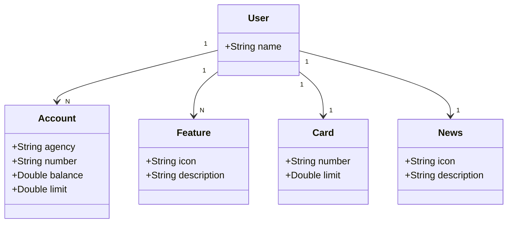

# Santander Dev Week 2023
Desafio de criação de uma Java RESTful API

## Diagrama de classes

```mermaid
classDiagram
    class User {
        +String name
    }

    class Account {
        +String agency
        +String number
        +Double balance
        +Double limit
    }

    class Feature {
        +String icon
        +String description
    }

    class Card {
        +String number
        +Double limit
    }

    class News {
        +String icon
        +String description
    }

    User "1" --> "N" Account
    User "1" --> "N" Feature
    User "1" --> "1" Card
    User "1" --> "1" News
```
